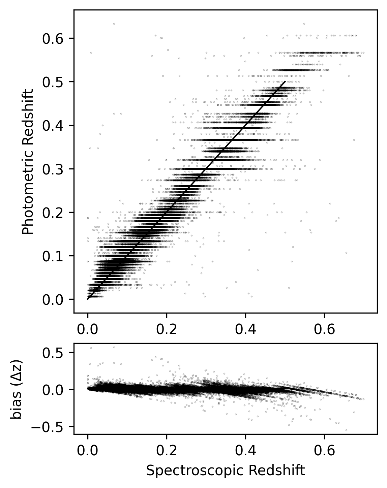

# Photometric redshift estimation of SDSS galaxies

Machine Learning models for the extraction of Photometric Redshifts from 64*64 ugriz images from the SDSS survey as part of my internship, titled:
"Machine Learning for photometric redshift estimation of LSST galaxies"

Any further questions/comments are welcome.

## Author

Anastasios Theodoropoulos

## Supervisor
Prof. Simona Mei
